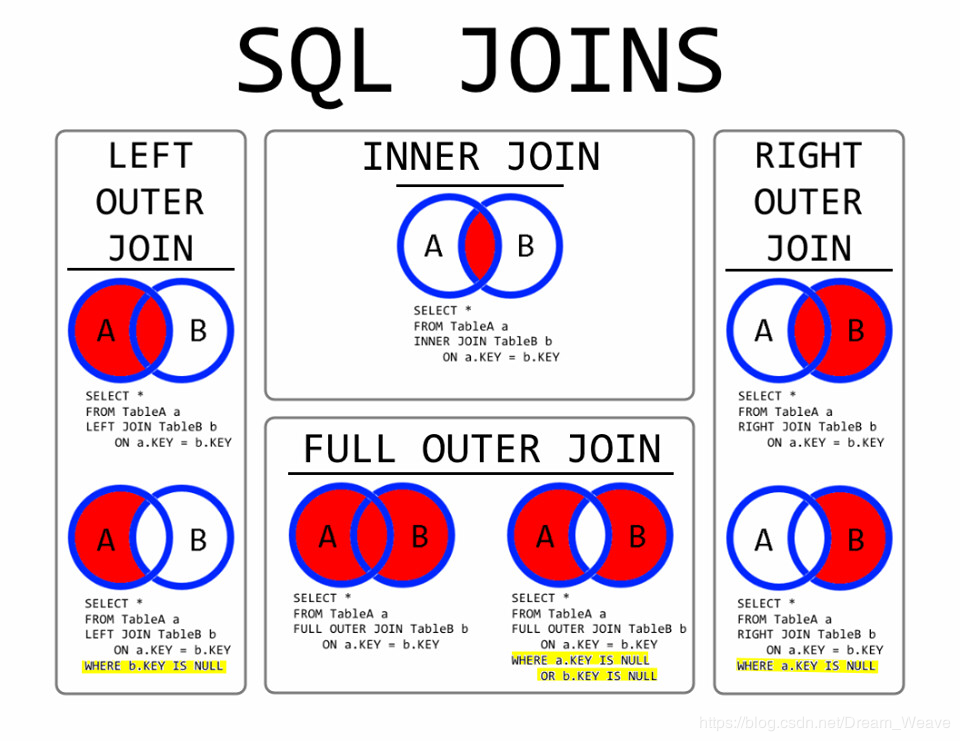

#### 一.数据库基础

##### 1.基本规则

1. sql语句以分号结尾
2. 关键字不区分大小写
3. 字符串和日期常数需要使用单引号`''`括起来，数字常数无需家主单引号

##### 2.表的基本操作

```sql
-- 创建
CREATE TABLE <表名>
（<列名1> <数据类型> <该列所需约束>，
<列名2> <数据类型> <该列所需约束>，
<列名3> <数据类型> <该列所需约束>，
<列名4> <数据类型> <该列所需约束>，
<该表的约束1>， <该表的约束2>，……）

-- 删除
DROP TABLE <表名>

-- 修改
ALTER TABLE <表名> ADD COLUMN <列名 类型 约束> --oracle和SQL Server 不用谢COLUMN，下同
ALTER TABLE <表名> DROP COLUMN <列名>

-- 修改表名
ALTER TABLE <表名> RAENAME TO <新表名> --Oracle
sp_rename '<表名>','<新表名>' -- SQL Server
RENAME TABLE <表名> to <新表名>


```

#### 二.查询基础

##### 1.select语句基础

```sql
-- 列出部分列  查询结果中列的顺序和SELECT 子句中的顺序相同
SELECT <列名>，……
FROM <表名>；

-- 列出全部列
SELECT *
FROM <表名>;

-- 为列设定别名
SELECT product_id AS id,
product_name AS name,
purchase_price AS price
FROM Product;

-- 常数查询
-- 'string'是字符串常数,38是数字常数 '2009-02-24' 是日期常数
SELECT '商品' AS string, 38 AS number, '2009-02-24' AS date,
product_id, product_name
FROM Product;

-- DISTINCT只能在第一列之前
-- 从结果中删除重复行
SELECT DISTINCT product_type
FROM Product;

-- DISTINCT在多列之前使用。此时，会将多个列的数据进行组合，将重复的数据
-- 合并为一条
SELECT DISTINCT product_type, regist_date
FROM Product;

-- where 子句
SELECT <列名>, ……
FROM <表名>
WHERE <条件表达式>;
-- 执行顺序
-- 首先通过 WHERE 子句查询出符合指定条件的记录，然后再选取出 SELECT 语句指定的列

```

##### 2.算数运算符和比较运算符

1. 算数运算

   `+ - * /`

   ```sql
   SELECT product_name, sale_price,
   sale_price * 2 AS "sale_price_x2"
   FROM Product;
   ```

2. 所有包含 `NULL` 的计算，结果肯定是 `NULL` 

3. 比较运算符

   `=`     	相等
   `<>`   	不相等

   `>=` 		大于等于
   `>`		大于
   `<=` 		小于等于
   `< ` 		小于

4. `NULL`值的处理

   ```sql
   <列名> is null
   <列名> is not null
   ```

##### 3.逻辑运算符

1. 多个查询条件进行组合时，需要使用`AND`运算符或者`OR`运算符
2. `NOT`谨慎使用
3. `()`改变优先级

#### 三.聚合和排序

##### 1.聚合查询

`COUNT`： 计算表中的记录数（行数）
`SUM`： 计算表中数值列中数据的合计值
`AVG`： 计算表中数值列中数据的平均值
`MAX`： 求出表中任意列中数据的最大值
`MIN`： 求出表中任意列中数据的最小值 

> ​      通常，聚合函数会对`NULL`以外的对象进行汇总。但是只有`COUNT`函数例外，使用`COUNT（*）`可以查出包含`NULL`在内的全部数据的行数 

```sql
-- 计算表中的所有行数
count(*)

-- 计算column=NULL之外的行数
count(`column`)

-- 去除column值重复后的行数
count(distinct `column`)
```

1. 通常，聚合函数会对`NULL`以外的对象进行汇总。但是只有`COUNT`函数例外，使用`COUNT（*）`可以查出包含`NULL`在内的全部数据的行数 
2. `MAX/MIN`函数几乎适用于所有数据类型的列。 `SUM/AVG`函数只适用于数值类型的列。
3. 只有`SELECT`子句和`HAVING`子句（以及`ORDER BY`子句）中能够使用聚合函数

##### 2.分组

1. `GROUP BY `子句中指定的列称为`聚合键` 

2. 聚合键中包含`NULL`时，在结果中会以“不确定”行（空行）的形式表现出来。即聚合键=`NULL`也分为一组

3. 使用 `WHERE` 子句进行汇总处理时，会先根据 WHERE 子句指定的条件进行过滤，然后再进行汇总处理。即执行顺序为`FROM → WHERE → GROUP BY → SELECT`

4. 注意点

    1. 使用聚合函数时， `SELECT` 子句中只能存在以下三种元素:
       ●	常数
       ●	聚合函数
       ● `GROUP BY`子句中指定的列名（也就是聚合键）

       原因:  当聚合后，聚合键与其他列是`一对多`的关系,当select其他列时就会出错

      	2. 在 `GROUP BY `子句中不能使用`SELECT` 子句中定义的别名,因为先执行`GROUP BY`子句再执行`SELECT`子句 

###### 3.为聚合指定条件

1. sql语序

   ```sql
   SELECT <列名1>, <列名2>, <列名3>, ……
   FROM <表名>
   GROUP BY <列名1>, <列名2>, <列名3>, ……
   HAVING <分组结果对应的条件>
   ```

2. `HAVING` 子句中能够使用的 3 种要素如下所示:
   ●	常数
   ●	聚合函数
   ● `GROUP BY`子句中指定的列名（即聚合键） 

   原因:  当聚合后，聚合键与其他列是`一对多`的关系,当以其他列为进行条件判断时就会出错

3. `where`和`having`的区别

   `WHERE` 子句 = 指定行所对应的条件
   `HAVING` 子句 = 指定组所对应的条件 

   聚合键所对应的条件不应该书写在`HAVING`子句当中，而应该书写在`WHERE`子句当中。

##### 4.排序

1. ● 使用`ORDER BY`子句对查询结果进行排序。
   ● 在`ORDER BY`子句中列名的后面使用关键字`ASC`可以进行升序排序，使用`DESC`关键字可以进行降序排序。
   ● `ORDER BY`子句中可以指定多个排序键。
   ● 排序健中包含`NULL`时，会在开头或末尾进行汇总。
   ● `ORDER BY`子句中可以使用`SELECT`子句中定义的列的别名。
   ● `ORDER BY`子句中可以使用`SELECT`子句中未出现的列或者聚合函数。
   ● `ORDER BY`子句中不能使用列的编号。 
2. 未指定`ORDER BY`子句中排列顺序时会默认使用`升序`进行排列。
3. 指定多个排序键 `(column1,column2,column3...)`,先按`column1`按指定排序，当`column1`值相同的有多行，再按`column2`来排序，依次等等
4. 在`ORDER BY`子句中可以使用`SELECT`子句中未使用的列和聚合函数
5. 执行顺序: `FROM → WHERE → GROUP BY → HAVING → SELECT → ORDER BY `

#### 四.数据更新

##### 1.INSERT

```sql
-- 一般插入表达式
INSERT INTO <表名> (列1, 列2, 列3, ……) 
VALUES (值1, 值2, 值3, ……),
			(值1, 值2, 值3, ……)
			(值1, 值2, 值3, ……);

-- 1.INSERT 语句中想给某一列赋予 NULL 值时,可以直接在 VALUES子句的值清单中写入NULL,
--   前提条件是该列允许NULL值
-- 2.当没有给某些列赋值，那么该列为默认值(如果设有约束条件)或者NULL  

-- insert into ... select ...
inseert into `table1` (column1,column2,column3,...)
select (column1_,column2_,column3_,...)
from `table2`
```

##### 2.DELETE

1. DROP TABLE 语句可以将表完全删除

2. DELETE语句会留下表(容器),而删除表中的全部数据

   ```sql
   -- 删除全部数据
   DELETE FROM <表名>; 
   TRUNCATE <表名>; -- sql标准中没有该指令，但主流DB都有提供，没有where子句
   
   -- 按条件删除
   DELETE FROM <表名>
   WHERE <条件>;
   ```

##### 3.UPDATE

```sql
UPDATE <表名>
SET <列名> = <表达式>[,<列名> = <表达式>,...]
[WHERE <条件>];
```

##### 4.事务

> 事务就是需要在同一个处理单元中执行的一系列更新处理的集合 

1. 原子性(Atomicity)

   > ​	原子性是指在事务结束时，其中所包含的更新处理要么全部执行，要么完全不执行，也就是要么占有一切要么一无所有。 

2. 一致性(Consistency)

   > ​	一致性指的是事务中包含的处理要满足数据库提前设置的约束，如主键约束或者 NOT NULL 约束等。也称为完整性 。

3. 隔离性(Isolation)

   > ​	隔离性指的是保证不同事务之间互不干扰的特性。该特性保证了事务之间不会互相嵌套。此外，在某个事务中进行的更改，在该事务结束之前，对其他事务而言是不可见的。因此，即使某个事务向表中添加了记录，在没有提交之前，其他事务也是看不到新添加的记录的。

4. 持久性(Durability)

   > ​	持久性也可以称为耐久性，指的是在事务（不论是提交还是回滚）结束后， DBMS 能够保证该时间点的数据状态会被保存的特性。 

#### 五.复杂查询

##### 1.视图

● 从SQL的角度来看，视图和表是相同的，两者的区别在于表中保存的是实际的数据，而视图中保存的是SELECT语句（视图本身并不存储数据）。
● 使用视图，可以轻松完成跨多表查询数据等复杂操作。
● 可以将常用的SELECT语句做成视图来使用。
● 创建视图需要使用CREATE VIEW语句。
● 视图包含“不能使用ORDER BY”和“可对其进行有限制的更新”两项限制。
● 删除视图需要使用DROP VIEW语句。 

<div></div>

视图优点:

   ● 视图无需保存数据，所以可以节省存储设备的容量

   ● 可以将频繁使用的select语句保存成视图，然后用于其他sql操作中，可以简化操作

```sql
-- 创建视图
CREATE VIEW 视图名称(<视图列名1>, <视图列名2>, ……)
AS
<SELECT语句>
-- 视图基础
-- 1. SELECT 语句中列的排列顺序和视图中列的排列顺序相同
-- 2. 视图和表一样，可以书写在 SELECT 语句的 FROM 子句之中
--    执行顺序:首先执行定义视图的select语句，然后根据得到的结果再执行from子句中使用视图的select语句
-- 3. 可以在视图上再定义视图，但这样查询效率较低

-- 视图的限制
-- 1. 定义视图时不能使用ORDER BY 子句
--    因为定义了即使使用了ORDER BY子句，也没有用，数据行是无序的
-- 2. 通过对视图的使用delete,update,insert操作，有严格的限制

-- 视图的删除
DROP VIEW 视图名称[(<视图列名1>, <视图列名2>, ……)] [CASCADE]
```

##### 2.子查询

1.非关联子查询

子查询和父查询之间没有关联，父查询中表的字段没有出现在子查询中。执行顺序是先执行子查询得到结果集，然后父查询运用该结果

2.关联子查询

外部查询和内部查询(子查询)有条件关联关系,

```sql
-- eg:
-- 查询出商品价格大于同类商品平均价的商品
select `name`,`price`
from `goods` as `g1`
where `price` > (
select avg(`price`)
from `goods` as `g2`
where `g1`.`type` = `g2`.`type`
group by `type` -- 该行可以省略.因为内部g1.type此时为常量,从而g2.type=常量,也就进行了分组
);
```

执行顺序:对`外层的每一行数据`，传递相关列的`值`到`内层`查询中作为已知`常数`，内层查询再使用该值进行相关操作得到对应的结果并将其返回，然后外层运用返回值来验证该行数据是否满足条件，从而进行相关操作。

#### 六.谓词

> 谓词就函数中的一种，是需要满足特定条件的函数，该条件就是返回值是真值 

##### 1.like

```sql
-- %：0个以及以上个字符
-- _: 任意一个字符
where `column` like '...'
```

##### 2.between 

```sql
where `column` between min and max -- 等价于
where `column` > min and `column` < max
```

##### 3.null

```sql
where `column` is null
where `column` is not null
```

##### 4.in

```sql
where `column` in (value1,value2,...)
where `column` not in (value1,value2,...)
```

##### 5.exist

```sql
-- 作为EXIST参数的子查询中经常会使用SELECT *

SELECT product_name, sale_price
FROM Product AS P -- 1
WHERE EXISTS (SELECT *
FROM ShopProduct AS SP -- 2
WHERE SP.shop_id = '000C'
AND SP.product_id = P.product_id);

-- not exist
```

#### 七.集合运算

以`行`为单位进行运算

<div></div>

```sql
-- 1. 作为运算对象的记录的列数必须相同
-- 2. 作为运算对象的记录中列的类型必须一致
-- 3. 可以使用任何select语句，但order by 子句只能在最后使用一次

-- eg:
SELECT product_id, product_name
FROM Product
UNION --(a+b) intersect(ab) except(a-ab)
SELECT product_id, product_name
FROM Product2
order by product_id;
```

#### 八.连接查询

以`列`为单位对表进行连接

<div></div>

```sql
-- 内连接
-- 含义:右表的每一行数据与左表的每一行做条件运算，拼接满足的条件的行，当扫描整个左表后没有一个成立，舍弃该 --      行
SELECT SP.shop_id, SP.shop_name, SP.product_id, P.product_name, 
P.sale_price
FROM ShopProduct AS SP INNER JOIN Product AS P -- 可以不取别名
ON SP.product_id = P.product_id;

-- 左外连接
-- 左表为主表，右边可以为空
-- 含义:右表的每一行数据与左表的每一行做条件运算，拼接满足的条件的行，当扫描整个左表后没有一个成立，让右边
--      该行与null拼接，右外连接相反。
SELECT SP.shop_id, SP.shop_name, SP.product_id, P.product_name, 
P.sale_price
FROM ShopProduct AS SP LEFT OUTER JOIN Product AS P 
ON SP.product_id = P.product_id;

-- 右外连接 右表为主表，左边可以为空
SELECT SP.shop_id, SP.shop_name, SP.product_id, P.product_name,  
P.sale_price
FROM ShopProduct AS SP RIGHT OUTER JOIN Product AS P  
ON SP.product_id = P.product_id;

-- 同样可以用where，group by,having,order by对拼接后的表(假设看作)做相关运算
```

#### 九.SQL执行顺序

```sql
(7) SELECT /* 处理SELECT列表，产生 VT7 */
(8) DISTINCT <select_list> /* 将重复的行从 VT7 中删除，产品 VT8 */
(1) FROM <left_table>  /* 对FROM子句中的表执行笛卡尔积(交叉联接)，生成虚拟表 VT1。 */
(3) <join_type> JOIN <right_table> /* 如果指定了OUTER JOIN(相对于CROSS JOIN或INNER JOIN)，
保留表中未找到匹配的行将作为外部行添加到 VT2，生成 VT3。如果FROM子句包含两个以上的表，则对上一个联接生成的结果表和下一个表重复执行步骤1到步骤3，直到处理完所有的表位置。   */
(2) ON <join_condition>/* 对 VT1 应用 ON 筛选器，只有那些使为真才被插入到 VT2。 */
(4) WHERE <where_condition>/* 对 VT3 应用 WHERE 筛选器，只有使为true的行才插入VT4。 */
(5) GROUP BY <group_by_list>   /* 按 GROUP BY子句中的列列表对 VT4 中的行进行分组，生成 VT5 */
(6) HAVING <having_condition>  /* 对 VT5 应用 HAVING 筛选器，只有使为true的组插入到 VT6 */
(9) ORDER BY <order_by_condition>  /* 将 VT8 中的行按 ORDER BY子句中的列列表顺序，生成一个游标(VC10)，
生成表TV11，并返回给调用者。 */
(10)LIMIT <limit_number>
```

````sql
-- 大体步骤:
from -> where -> group by -> having -> select -> order by -> limit

-- 1. having 是对group by的分组结果再过滤,所以having只能在group by 存在时使用,通常接聚合函数作为条件
-- 2. where 是对每一条记录过滤
````

参考

#### 十.连接查询分类



[图片来源](https://www.cnblogs.com/liyongke/p/10528386.html)

