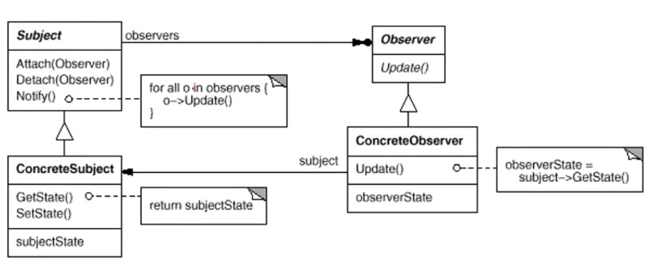

> 定义对象之间的一种一对多(变化)的依赖关系，以便当一个对象(subject)的状态发生变化时，所有依赖于它的对象都得到通知并自动更新

<div align="center"></div>

```java
/**
 * 观察者接口
 */
interface  Observer {
    /**
     * 更新observer
     * @param o 目标对象
     * @param args 额外参数
     */
    void update(Observable o,Object args);
}

/**
 * 目标对象接口
 */
abstract class Observable{
    /**
     * 保存observer
     */
    private List<Observer> observers = new ArrayList<>();

    /**
     * 注册observer
     * @param observer
     */
    public Observable registerObserver(Observer observer){
        observers.add(observer);
        return this;
    }

    /**
     * 去除observer
     * @param observer
     */
    public Observable removeObserver(Observer observer){
        observers.remove(observer);
        return this;
    }

    /**
     * 更新所有的observer
     * @param args
     */
    public void notifyObservers(Object args){
        for (Observer observer :
                observers) {
            observer.update(this, args);
        }
    }
}

/**
 * 目标对象(被观察者)
 */
class Subject extends Observable{
    private String state;

    public Subject(String state) {
        this.state = state;
    }

    public String getState() {
        return state;
    }

    /**
     * 改变状态===>通知所有observer
     * @param state
     */
    public void setState(String state) {
        this.state = state;
        notifyObservers(null);
    }
}

/**
 * 第一个类观察者
 */
class Observer1 implements Observer{
    @Override
    public void update(Observable o, Object args) {
        if(o instanceof Subject) {
            System.out.println("observer1:"+"我收到subject状态更新为"+((Subject) o).getState());
        }
        //...自我的更新
    }
}

/**
 * 第二个类观察者
 */
class Observer2 implements Observer{
    @Override
    public void update(Observable o, Object args) {
        if(o instanceof Subject) {
            System.out.println("observer2:"+"我收到subject状态更新为"+((Subject) o).getState());
        }
        //...自我的更新
    }
}

public class Test {
    public static void main(String[] args) {
        Observer1 observer1 = new Observer1();
        Observer2 observer2 = new Observer2();
        Subject subject = new Subject("0");
        subject.registerObserver(observer1).registerObserver(observer2);
        subject.setState("1");
    }
}

```

[参考链接-1](<https://www.cnblogs.com/ClassNotFoundException/p/6240216.html>)

