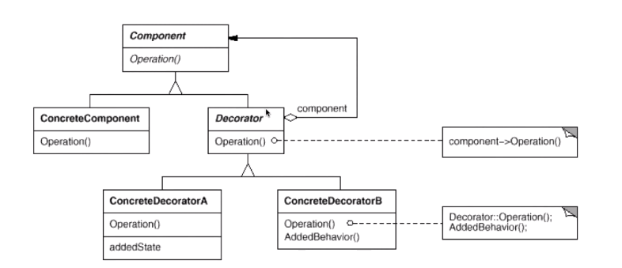

动态(组合)地给一个对象怎加一额外的职责。就增加功能而言，decorator模式比生成子类(继承)更为灵活(消除重复代码和减少子类个数)

```bash
# X Y Z为增强功能
#继承版
-A
 ---B
    ---XB
    ---YB
    ---ZB
 ---C
    ---XC
    ---YC
    ---ZC
 ---D
    ---XD
    ---YD
    ---ZD
#装饰者版
-A
 ---B
 ---C
 ---D
 X(A) Y(A) Z(A) # X,Y,Z 持有A的引用，可以同时装饰B,C,D
```

<div align="center"></div>

```java
/**
 * 组件接口
 */
interface Component{
    void operation();
}

/**
 * 装饰接口
 */
abstract class Decorator implements  Component{
    private Component component;

    public Decorator(Component component){
        this.component = component;
    }

    @Override
    public void operation() {
        component.operation();
    }
}

/**
 * 具体组件
 */
class ConcreteComponent implements Component{
    @Override
    public void operation() {
        //...
    }
}

/**
 * 具体装饰者1
 */
class ConcreteDecoratorA extends Decorator implements Component{

    public ConcreteDecoratorA(Component component){
        super(component);
    }

    @Override
    public void operation() {
        addedFunction();
        super.operation();
    }

    /**
     * 功能增强方法
     */
    public void addedFunction(){
        //...
    }
}

/**
 * 具体装饰者2
 */
class ConcreteDecoratorB extends Decorator implements Component{

    public ConcreteDecoratorB(Component component){
        super(component);
    }

    @Override
    public void operation() {
        addedFunction();
        super.operation();
    }

    /**
     * 功能增强方法
     */
    public void addedFunction(){
        //...
    }
}

public class Test {
    public static void main(String[] args) {
        Component component  = new ConcreteComponent();
        Decorator addedComponenta = new ConcreteDecoratorA(component);
        Decorator addedComponentb = new ConcreteDecoratorB(component);
        addedComponenta.operation();
        addedComponentb.operation();
    }
}
```

