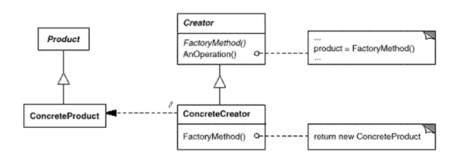

> 定义一个用于创建按对象的接口，让子类决定实例化哪一个类。factory method 是的一个类的实例化延迟到子（目的:解耦）类。

<div align="center">

```java
interface Product{}
interface Factory{Product createProduct();}

class ProductA implements Product{}
class ProductB implements Product{}
class ProductC implements Product{}

class FactoryA implements Factory{
    @Override
    public Product createProduct() {
        return new ProductA();
    }
}
class FactoryB implements Factory{
    @Override
    public Product createProduct() {
        return new ProductB();
    }
}
class FactoryC implements Factory{
    @Override
    public Product createProduct() {
        return new ProductC();
    }
}

class Customer{
    Product product;

    void operation(Factory factory){
        //...
        product = factory.createProduct();
        //...
    }
}
```

