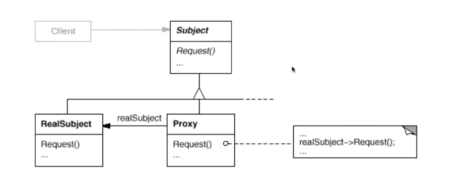

> 为其他对象提供一种代理以控制(隔离，使用接口)对这个对象的访问

<div align="center">

```java

/**
 * 目标接口
 */
interface  Subject{void operation();}

/**
 * 目标接口实现类
 */
class ConcreteSubject implements Subject{
    @Override
    public void operation() {
        //...
    }
}

/**
 * 代理对象
 * 同样需实现目标接口，对外提供同一的接口
 */
class ProxySubject implements Subject{
    //真实对象
    private Subject realSubject;
    public ProxySubject(Subject realSubject){this.realSubject = realSubject;}
    @Override
    public void operation() {
        //before...
        realSubject.operation();
        //after...
    }
}

public class Test {
    public static void main(String[] args) {
        ProxySubject proxy = new ProxySubject(new ConcreteSubject());
        proxy.operation();
    }
}
```

