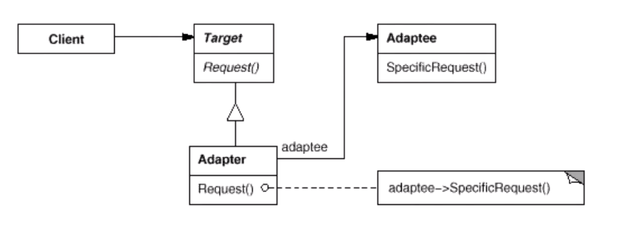

> 将一个类的接口转换为客户希望的另一个接口。adapter模式使得原本由于接口不兼容而不能一起工作的那些类可以一起工作

<div align="center"></div>

```java
/**
 * 目标(新)接口
 */
interface Target{
    void request();
}

/**
 * 原始(老)接口
 */
interface Adaptee{
    void operation();
}

/**
 *原始接口的实现类
 */
class ConcreteAdaptee implements  Adaptee{
    @Override
    public void operation() {
        //...
    }
}


/**
 * 适配器类
 * 继承目标(新)接口，并持有一个原始(老)接口的实现类的实例
 */
class Adapter implements  Target{
    private Adaptee adaptee;
    public Adapter(Adaptee adaptee){
        this.adaptee = adaptee;
    }
    @Override
    public void request() {
        //...
        adaptee.operation();
        //...
    }
}

public class Test {
    public static void main(String[] args) {
        Target target = new Adapter(new ConcreteAdaptee());
        target.request();
    }
}
```

