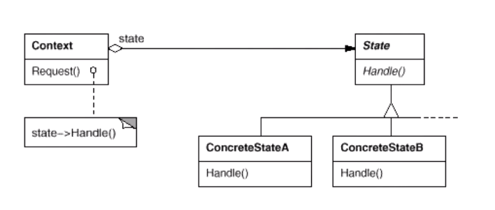

>  允许对象在其内部状态更改时更改其行为

<div align="center"></div>

```java
interface State{
    void handle(Context context);
}

/**
 * 演示state A -- > B
 *           < --
 */
class StateA implements State{
    @Override
    public void handle(Context context) {
        //...
        System.out.println("A---handle");
        context.setState(new StateB());
    }
}
class StateB implements State{
    @Override
    public void handle(Context context) {
        //...
        System.out.println("B---handle");
        context.setState(new StateA());
    }
}

/**
 * state的包裹类
 */
class Context{
    private State state;

    public Context(State state){setState(state);}

    public void setState(State state){
        this.state = state;
    }

    public State getState() {
        return state;
    }

    public  void operation(){
        state.handle(this);
    }
}

public class Test {
    public static void main(String[] args) {
        Context context = new Context(new StateA());
        context.operation();
        context.operation();
        context.operation();
    }
}
```

