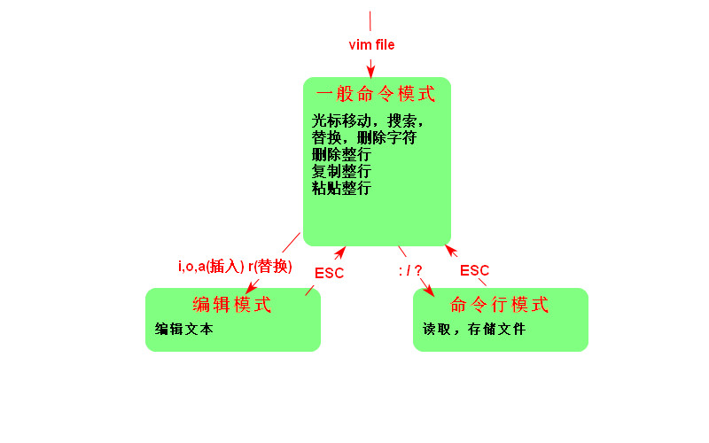

#### 1.命令行模式下命令的执行

1. ##### 开始执行命令

```bash
command [-options] parameter1 parameter2
# 不论shell有多少个空格，只会视为一个
# 在linux系统中，区分字母大小写
```

##### 2.基础命令的操作

```bash
date [+%Y-%m-%d]#格式化输出
cal  [month] [year] #日历
bc   #简单计算器
```

3. ##### 热键

`[Tab]` 命令补全、参数补全、文件名补全

`[Ctrl]-c` 终止当前运行的程序

`[Ctrl]-d` 键盘输入结束，退出命令模式，退出root用户模式

4. 查看帮助信息

```bash
command --help
man command
```

#### 2.用户和用户组

文件拥有者

用户组

其他人:用户组外的人

#### 3.文件权限和属性

##### 1.`ls -al`

`ls`是`list`，显示文件的文件名和属性，`-al`列出权限和属性，包括隐藏的文件

##### 2.文件的详细信息

```bash
-rwxr-xr-- 1 young young 3771 5月  25 17:19 .bashrc
#文件类型
# 用户/组/其他人的权限
#        链接次数
#            用户名 组名 文件大小(byte)
#                              创建时间或最后修改的时间
#                                           文件名
```

​       **第一个字符代表这个文件的类型**

​      `[d] ` : 目录

​      `[-]`:文件

​      `[l]`:链接文件

​      `[b]`:存储设备

​      `[c]`:串行端口设备，例如键盘、鼠标

​       **[rwx]**

​       `[r]`可读  `[w]`可写  `[x]`可执行

​        注意这三个权限的位置不会改变，如果没有权限用`[-]`代替

##### 3.修改属性和权限

1. 修改用户组`chgrp`

   ```bash
   chgrp groupName [-R] dirName/fileName #-R递归修改
   ```

2. 修改拥有者`chown`

   ```bash
   chown owner [-R] firName/fileName #-R递归修改
   ```

3. 修改权限

   数字类型修改文件权限

   r:4 w:2 x:1

   ```bash
   chmod 777 [-R] dirName/fileName #-R递归修改
   ```

   符号类型修改文件权限

   | chmod | u g o a | + -  = | r w x | 文件或目录 |
   | ----- | ------- | ------ | ----- | ---------- |
   | chmod | u g o a | + - =  | r w x | file/dir   |

   ​      u:user g:group o:others a:all

   ​     +:添加 -:删除 =：设置

```bash
chmod u=rwx,go=rx fileName #rwxr-xr-x
chmod a+w fileName #给所有人添加w权限
chmod o-x fileName #给其他人删除x权限
```

##### 4.目录和文件的权限意义

1. 权限对文件的意义

​        r:读取

​        w:可写，编辑

​        x:可执行 ，一个文件是否可以执行，不是看文件后缀名，而是是否具有`x`权限

2. 权限对目录的意义

​       目录:存储文件名列表

​        r:读取目录结构表

​        w:改动目录结构

​         x:用户能为进入该目录能否成为工作目录

##### 5.Linux文件种类和扩展名

在Linux中，要树立一切皆文件的思想

| 描述              |                     文件种类                     |
| ----------------- | :----------------------------------------------: |
| 纯文本文件(ASCII) |                                                  |
| 二进制文件        |                                                  |
| 数据文件          |                  特定格式的文件                  |
| 目录              |                                                  |
| 链接文件          |                类似window快捷方式                |
| 区块设备文件      | 存储数据，以提供系统随机存储的接口设备，例如磁盘 |
| 字符设备文件      |            串行设备文件，例如键盘输入            |
| 数据接口文件      |           网络上的数据交换，例如socket           |

文件扩展名

一个文件能不能被执行，与属性有关，而与文件名没有关系。

#### 4.目录与路径

##### 1.相对路径和绝对路径

绝对路径:一定从根目录`/`写起

相对路径:不由`/`写起

##### 2.目录相关操作

`. `: 此层目录

`..`: 上一层目录

`~`:当前用户的home目录

1. cd 切换目录

```bash
cd 相对路径/绝对路径
```

2. pwd 显示当前目录
3. mkdir 创建一个新的目录

```bash
mkdir [-mp] dirName
# -m 设置权限
# -p 递归创建目录rmdir
```

4. 删除目录

```bash
rmdir [-p] dirName
#-p 连同上一层空的目录也一起删除
```

##### 3.文件操作

1. cp 复制文件或目录

```bash
cp [-alr] source destination
#-a 保持destinamtion属性和权限不变
#-l 创建链接文件
#-r 递归复制文件
cp [options] source1 souce2 ... dirctory
# 当有多个文件被复制时，目标文件必须是
```

2. rm 删除文件或目录

```bash
rm [-fir] 文件或目录
#-f 强制删除
#-i 删除提示
#-r 递归删除
```

3. mv 移动文件与目录，或重命名 

```bash
mv [-fiu] source destination
#-f 强制
#-i 提示
#-u 若目标文件已经存在，且source比较新，才会更新(update)
mv [options] source1 source2 ... directory
```

#### 5.文件内容查看

##### 1.cat

```bash
cat [-n] file #-n显示行号
```

##### 2.翻页

```bash
more file
#space 向下翻一页
#Enter 下一行
#:f 显示文件名和当前行数
#q 退出more 

less file
#space 向下翻一页
#pagedown 下一页
#pageup 上一页
#/字符串 向下查找字符串
#?字符串 向上查找字符串
```

##### 3.数据截取

```bash
head [-n number] file #-n number 显示前多少行
head [-n -number] file #后多少行不打印

tail [-n number] file #-n number 显示后多少行
tail [-n +number] file #只列出多少行后数据
```

#### 6.文件查找

##### 1.whereis

```bash

```

##### 2.locate

```bash

```

##### 3.find

```bash

```

#### 7.软件维护

```bash
sudo apt install 软件名 #安装
suso apt remove 软件名 #卸载
sudo apt upgrade 软件名 #更新
```

#### 8.打包和解压缩

##### 1.tar

只负责打包，不负责压缩

```bash
tar -cvf destination.tar file1 file2 .../director #打包
tar -xvf source.tar #解包
#-c 创建tar文件
#-x 解包
#-v 列出详细过程
#-f 指定名称
```

##### 2.gzip

只能对单个文件进行压缩，若为目录压缩，要先打包

```bash
tar -zcvf destination.tar.gz file1 file2 .../director #压缩
tar -zxvf source.tar.gz [-C  destination] #解压缩
#-z 使用gzip命令压缩
```

##### 3.bzip2

```bash
tar -jcvf destination.tar.bz2 file1 file2 .../director #压缩
tar -jxvf source.tar.bz2 [-C destination] #解压缩
#-j 使用bzip2解压缩
```

#### 9.vim

##### 1.状态模式

<div align="center"></div>


##### 2.一般命令模式

```bash
#查找
/word 向下查找一个匹配的词
?word 向上查找一个匹配的词
n 重复前一个查找操作
N 重复(反向)前一个查找操作
#替换
:n1,n2s/word1/word2/g #将n1-n2行中word1替换为word2
:n1,$s/word1/word2/g  #将n1-末行中word1替换为word2
#删除
x #相当于[del]
X #相当于[backspace]
dd #删除光标所在行
ndd #删除光标所在的向下n行
#复制
yy #复制光标所在行
nyy #复制光标所在行下n行
#粘贴
p  #粘贴到光标下一行
P  #粘贴到光标上一行
```

##### 3.命令行模式

```bash
:w #写到硬盘
:q #退出vim
:wq #写到并退出
:w flieName #另存为fileName
```

#### 10.基本bash

##### 1.基本概念

1. `shell`接收来自使用者的命令，以于内核进行沟通
2. `/bin/bash `是Linux默认的shell
3. `上下键`可以查看上一次和下次的命令
4. `Tab` 自动补全命令和文件名
5. `\`转义字符,eg:`\[enter]`命令行可以接着输入
6. 用`type`来查询命令是否为`bash shell`的内置命令

##### 2.shell的变量功能

1. **变量**

   `varible=value` 	`=`两边没有`   `空格

   `$varible ${varible}`

2. **单引号和双引号**

   `双引号`内的特殊字符如$等，可以保有原本的特性

   `单引号`内的特殊字符如$等，失去保有原本的特性，被当作纯文本

   ```she
   name=young
   echo "${name} is my name" #输出 young is my name
   echo '${name} is my name' #输出 ${name} is my name
   ```

##### 3.环境变量