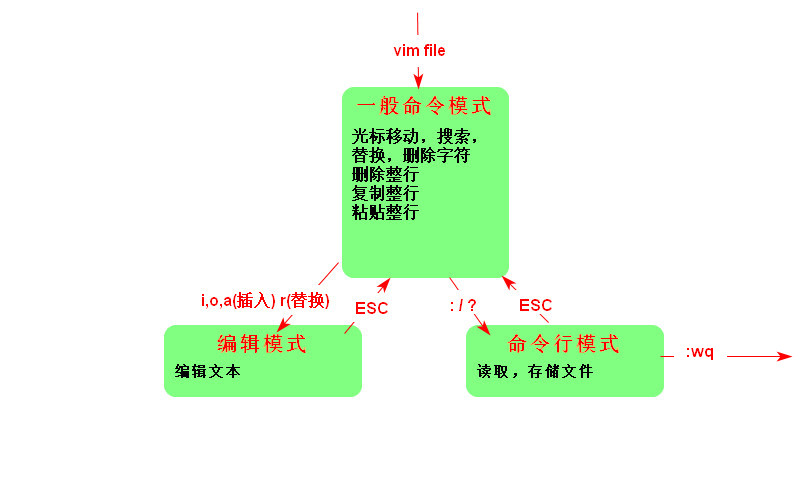
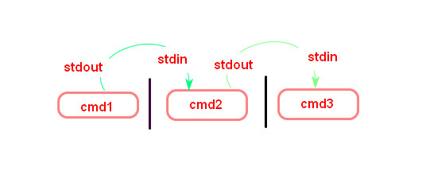

#### 1.命令行模式下命令的执行

1. ##### 开始执行命令

```bash
command [-options] parameter1 parameter2
# 不论shell有多少个空格，只会视为一个
# 在linux系统中，区分字母大小写
```

##### 2.基础命令的操作

```bash
date [+%Y-%m-%d]#格式化输出
cal  [month] [year] #日历
bc   #简单计算器
```

3. ##### 热键

`[Tab]` 命令补全、参数补全、文件名补全

`[Ctrl]-c` 终止当前运行的程序

`[Ctrl]-d` 键盘输入结束，退出命令模式，退出root用户模式

4. 查看帮助信息

```bash
command --help
man command
```

#### 2.用户和用户组

文件拥有者

用户组

其他人:用户组外的人

#### 3.文件权限和属性

##### 1.`ls -al`

`ls`是`list`，显示文件的文件名和属性，`-al`列出权限和属性，包括隐藏的文件

##### 2.文件的详细信息

```bash
-rwxr-xr-- 1 young young 3771 5月  25 17:19 .bashrc
#文件类型
# 用户/组/其他人的权限
#        链接次数
#            用户名 组名 文件大小(byte)
#                              创建时间或最后修改的时间
#                                           文件名
```

​       **第一个字符代表这个文件的类型**

​      `[d] ` : 目录

​      `[-]`:文件

​      `[l]`:链接文件

​      `[b]`:存储设备

​      `[c]`:串行端口设备，例如键盘、鼠标

​       **[rwx]**

​       `[r]`可读  `[w]`可写  `[x]`可执行

​        注意这三个权限的位置不会改变，如果没有权限用`[-]`代替

##### 3.修改属性和权限

1. 修改用户组`chgrp`

   ```bash
   chgrp groupName [-R] dirName/fileName #-R递归修改
   ```

2. 修改拥有者`chown`

   ```bash
   chown owner [-R] firName/fileName #-R递归修改
   ```

3. 修改权限

   数字类型修改文件权限

   r:4 w:2 x:1

   ```bash
   chmod 777 [-R] dirName/fileName #-R递归修改
   ```

   符号类型修改文件权限

   | chmod | u g o a | + -  = | r w x | 文件或目录 |
   | ----- | ------- | ------ | ----- | ---------- |
   | chmod | u g o a | + - =  | r w x | file/dir   |

   ​      u:user g:group o:others a:all

   ​     +:添加 -:删除 =：设置

```bash
chmod u=rwx,go=rx fileName #rwxr-xr-x
chmod a+w fileName #给所有人添加w权限
chmod o-x fileName #给其他人删除x权限
```

##### 4.目录和文件的权限意义

1. 权限对文件的意义

​        r:读取

​        w:可写，编辑

​        x:可执行 ，一个文件是否可以执行，不是看文件后缀名，而是是否具有`x`权限

2. 权限对目录的意义

​       目录:存储文件名列表

​        r:读取目录结构表

​        w:改动目录结构

​         x:用户能为进入该目录能否成为工作目录

##### 5.Linux文件种类和扩展名

在Linux中，要树立一切皆文件的思想

| 描述              |                     文件种类                     |
| ----------------- | :----------------------------------------------: |
| 纯文本文件(ASCII) |                                                  |
| 二进制文件        |                                                  |
| 数据文件          |                  特定格式的文件                  |
| 目录              |                                                  |
| 链接文件          |                类似window快捷方式                |
| 区块设备文件      | 存储数据，以提供系统随机存储的接口设备，例如磁盘 |
| 字符设备文件      |            串行设备文件，例如键盘输入            |
| 数据接口文件      |           网络上的数据交换，例如socket           |

文件扩展名

一个文件能不能被执行，与属性有关，而与文件名没有关系。

#### 4.目录与路径

##### 1.相对路径和绝对路径

绝对路径:一定从根目录`/`写起

相对路径:不由`/`写起

##### 2.目录相关操作

`. `: 此层目录

`..`: 上一层目录

`~`:当前用户的home目录

1. cd 切换目录

```bash
cd 相对路径/绝对路径
```

2. pwd 显示当前目录
3. mkdir 创建一个新的目录

```bash
mkdir [-mp] dirName
# -m 设置权限
# -p 递归创建目录rmdir
```

4. 删除目录

```bash
rmdir [-p] dirName
#-p 连同上一层空的目录也一起删除
```

##### 3.文件操作

1. cp 复制文件或目录

```bash
cp [-alr] source destination
#-a 保持destinamtion属性和权限不变
#-l 创建链接文件
#-r 递归复制文件
cp [options] source1 souce2 ... dirctory
# 当有多个文件被复制时，目标文件必须是
```

2. rm 删除文件或目录

```bash
rm [-fir] 文件或目录
#-f 强制删除
#-i 删除提示
#-r 递归删除
```

3. mv 移动文件与目录，或重命名 

```bash
mv [-fiu] source destination
#-f 强制
#-i 提示
#-u 若目标文件已经存在，且source比较新，才会更新(update)
mv [options] source1 source2 ... directory
```

#### 5.文件内容查看

##### 1.cat

```bash
cat [-n] file #-n显示行号
```

##### 2.翻页

```bash
more file
#space 向下翻一页
#Enter 下一行
#:f 显示文件名和当前行数
#q 退出more 

less file
#space 向下翻一页
#pagedown 下一页
#pageup 上一页
#/字符串 向下查找字符串
#?字符串 向上查找字符串
```

##### 3.数据截取

```bash
head [-n number] file #-n number 显示前多少行
head [-n -number] file #后多少行不打印

tail [-n number] file #-n number 显示后多少行
tail [-n +number] file #只列出多少行后数据
```

#### 6.文件查找

##### 1.whereis

```bash

```

##### 2.locate

```bash

```

##### 3.find

```bash

```

#### 7.软件维护

```bash
sudo apt install 软件名 #安装
suso apt remove 软件名 #卸载
sudo apt upgrade 软件名 #更新
```

#### 8.打包和解压缩

##### 1.tar

只负责打包，不负责压缩

```bash
tar -cvf destination.tar file1 file2 .../director #打包
tar -xvf source.tar #解包
#-c 创建tar文件
#-x 解包
#-v 列出详细过程
#-f 指定名称
```

##### 2.gzip

只能对单个文件进行压缩，若为目录压缩，要先打包

```bash
tar -zcvf destination.tar.gz file1 file2 .../director #压缩
tar -zxvf source.tar.gz [-C  destination] #解压缩
#-z 使用gzip命令压缩
```

##### 3.bzip2

```bash
tar -jcvf destination.tar.bz2 file1 file2 .../director #压缩
tar -jxvf source.tar.bz2 [-C destination] #解压缩
#-j 使用bzip2解压缩
```

#### 9.vim

##### 1.状态模式

<div align="center"></div>


##### 2.一般命令模式

```bash
#查找
/word 向下查找一个匹配的词
?word 向上查找一个匹配的词
n 重复前一个查找操作
N 重复(反向)前一个查找操作
#替换
:n1,n2s/word1/word2/g #将n1-n2行中word1替换为word2
:n1,$s/word1/word2/g  #将n1-末行中word1替换为word2
#删除
x #相当于[del]
X #相当于[backspace]
dd #删除光标所在行
ndd #删除光标所在的向下n行
#复制
yy #复制光标所在行
nyy #复制光标所在行下n行
#粘贴
p  #粘贴到光标下一行
P  #粘贴到光标上一行
```

##### 3.命令行模式

```bash
:w #写到硬盘
:q #退出vim
:wq #写到并退出
:w flieName #另存为fileName
```

#### 10.基本bash

##### 1.基本概念

1. `shell`接收来自使用者的命令，以于内核进行沟通
2. `/bin/bash `是Linux默认的shell
3. `上下键`可以查看上一次和下次的命令
4. `Tab` 自动补全命令和文件名
5. `\`转义字符,eg:`\[enter]`命令行可以接着输入
6. 用`type`来查询命令是否为`bash shell`的内置命令

##### 2.shell的变量功能

1. **变量**

   `variable=value` 	`=`两边没有`   `空格

   `$variable ${variable}` 

   **建议取变量的值用**`${variable}`

2. **单引号和双引号**

   `双引号`内的特殊字符如$等，可以保有原本的特性

   `单引号`内的特殊字符如$等，失去保有原本的特性，被当作纯文本

   ```she
   name=young
   echo "${name} is my name" #输出 young is my name
   echo '${name} is my name' #输出 ${name} is my name
   ```

##### 3.环境变量

`HOME` `PATH` 

##### 4.read array declare

1. **read**

   ```bash
   read [-pt] variable
   #-p 后面可以接提示字符
   #-t 后面可以等待的秒数
   read -p "your name:" name
   your name:young
   echo ${name} #young
   ```

2. **declare**

   ```bash
   declare [-aixr] varible
   #-a 将后面名为variable的变量定义为数组类型
   #-i 将后面名为variable的变量定义为整数类型
   #-x 用法与export一样，将后面的variable编程环境变量
   #-r 将变量定义为只读类型
   
   young@young:~$ declare -a names
   young@young:~$ names[0]=young
   young@young:~$ names[1]=tom
   young@young:~$ names[2]=jerry
   young@young:~$ echo ${names[0]} ${names[1]} ${names[2]}
   young tom jerry
   
   young@young:~$ declare num=1+1
   young@young:~$ echo ${num}
   1+1
   young@young:~$ declare -i num=1+1
   young@young:~$ echo ${num}
   2
   
   young@young:~$ declare -r name=young
   young@young:~$ name=ll
   bash: name: 只读变量
   young@young:~$ echo ${name}
   young
   ```

##### 5.数据重定向

1. **通配符**

   `*`:0-n个字符

   `?`:1-n个字符

   `[]`:其中任意一个字符

   `[-]`:按顺序的排列中的一个字符

   `[^]`:不在其中的一个字符

2. **数据重定向**

   `1>`:以覆盖的方法将正确的数据输出到指定的文件和设备上

   `1>>`:以累加的方法将正确的数据输出到指定的文件和设备上

   `2>`:以覆盖的方法将错误的数据输出到指定的文件和设备上

   `2>>`:以累加的方法将错误的数据输出到指定的文件和设备上

​        `<`:重定向输入程序

3. **多条命令执行**

   `;`:cmd;cmd

   `&&`:与，短路

   `||`:或，短路

4. **管道**

   <div align="center"></div>

    ```bash
   #cut 切出一行的部分片段
   cut -d '分隔符' -f n #用分隔符分成几段，然后取第n段
   cut -c m-n #取第下标在m-n之间的字符
   
   #grep 找出满足条件的所有行
   frep [-acinv] '查找字符' file
   #-a 将二进制文件以文本文件的方式查找数据
   #-c 计算找到字符的总数
   #-i 忽略大小写
   #-n 输出该行在原文中的行号
   
   #sort
   sort -t '分隔符' -k n #用分隔符分割后，按照第n列来排序
   
   #uniq
   uniq [-ic]
   #-i 忽略大小写
   #-c 进行记数
   
   #wc
   wc [-lwm]
   #-l 行数
   #-w 词数
   #-m 字符数
    ```


#### 11.正则表达式

##### 1.基本正则表达式

| RE字符        | 意义                               |
| :------------ | ---------------------------------- |
| `^word`       | 待查找的字符串word在行首           |
| `word$`       | 待查找的字符串word在行尾           |
| `.`           | d代表任意一个字符                  |
| `\`           | 转义字符，将特殊字符的特殊意义去除 |
| `*`           | 重复零个到无穷多个的前后一个RE字符 |
| `[a-zA-Z0-9]` | 匹配里面一个字符                   |
| `[^word]`     | 不匹配其中任意一个字符             |
| `\{m,[n]\}`   | 连续m到n个的前一个字符RE           |

##### 2.sed工具

sed是一个管道命令，可以分析`stdin`,而且还可以将数据替换、删除、新增、选定等特定功能。

```bash
####################################################################################
sed [-i] ['[n1[,n2]][ads]'] [file]
#-i 修改file
#n1,n2 修改n1-n2行 $:最后一行
#a 在指定行下面增加一行
#d 删除指定行
#s 替换指定行内容 eg: '1,5s/old/new/g'
####################################################################################

sed -i '1,$s/tt/test/g' test.txt #将文本tt替换为test
sed -i '1d' test.txt #删除删除第一行
sed -i '$a hello the world!' test.tx #在末行添加一行hello thw world!
sed '1,2d' test.txt > dest.txt #将源文件的数据删除1-2行后的结果写入dest.txt,由于没有-i参数，所以是不会影响到源文件的
```

#### 12.shell脚本

##### 1.传递参数

| 参数        | 含义            | 举例                  |
| ----------- | --------------- | --------------------- |
| ${0}        | 脚本名          | ./test.sh             |
| ${n} (n!=0) | 传入的第n个参数 | ${1},传入的第一个参数 |
| $#          | 传入的参数个数  |                       |
| $@          | 参数列表        | ["$1" "$2" "$3"]      |
| $*          | 参数列表        | ["$1 $2 $3"]          |

##### 2.基本运算符

1. **算数运算符**

   `+  -  *  /  %  =  ==  !=`

   ```shell
   #!/bin/bash
   
   a=${1} # 20
   b=$((((${a}*3+2)/2-1)%4))
   echo "${b}" # 2
   ```

   `$((...))`：算数运算

   `()`:改变优先级

2. **关系运算符**

   适用于`数值`或`数值类型字符串`

   | 运算符 | 含义                    |
   | ------ | ----------------------- |
   | -eq    | equals                  |
   | -ne    | not equals              |
   | -gt    | greater than            |
   | -lt    | lesser than             |
   | -ge    | greate than and equals  |
   | -le    | lesser  than and equals |

   ```bash
   #判断a>=20 && a<=30
   [ ${a} -ge 20 ] && [ ${a} -le 30 ] #或
   [[ ${a} -ge 20 && ${a} -le 30 ]]
   #注意各组件两端要空格
   ```

3.**字符串运算符**

| 运算符 | 含义        |
| ------ | ----------- |
| =      | 验证相等    |
| !=     | 验证不相等  |
| -n     | 长度是否为0 |
| $      | 是否为空    |

##### 3.流程控制

1.**条件运算**

```bash
if [ 条件 ] #[]两侧必须有空格 
then
   #...
elif [ 条件 ]
then
		#...
elif [ 条件 ]
then
		#...
if #if语句结束
```

2.**while**

```bash
####################################################################################
while [ 条件 ]
do
		#...
done
####################################################################################
#eg:
#!/bin/bash

n=10
i=1
sum=0
while [ ${i} -le 10 ] # <=
do
	sum=$((${sum}+${i}))
	i=$(($i+1))
done
echo "${sum}"#55
```

3.**for**

```bash
####################################################################################
for var in con1 con2 con3 ... #var一次取值con1,con2,con3...
do
	#...
done
####################################################################################
#eg:
#!/bin/bash
for var in 1 2 3
do
	echo ${var}
done

#!/bin/bash
sum=0
for var in {1..100} #1+2+3+...+100
do
	sum=$((${sum}+${var}))
done
echo "${sum}"

#!/bin/bash
for var in $(ls /home/young/) #遍历/home/young/下的文件
do
	echo ${var}
done

####################################################################################
for (( 初始值; 限制条件; 赋值运算 ))
do
	#...
done
####################################################################################
#eg:
#!/bin/bash
sum=0
read -p "输入一个正整数:" num
for (( i=0; i<=${num}; i=i+1 )) #(( ... ))
do 
	sum=$((${sum}+${i}))
done
echo "sum=${sum}"
```


