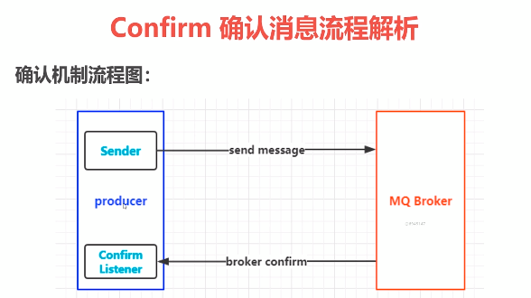

confirm message

1. 消息的确认是指生产者在投递消息后，如果broker收到消息，则会给我们生产者一个应答

2. 生产者进行接收者应答，用来确定这条消息是否正常发送到broker,这种方式也是消息的可靠性投递的核心保障

确认消息实现

1. 在channel上开启确认模式:`channel.confirmSelect()`
2. 在channel上添加监听:`addConfirmListener`,监听成功和失败的返回结果，根据具体的结果对消息进行重新发送或记录日志等后续处理

