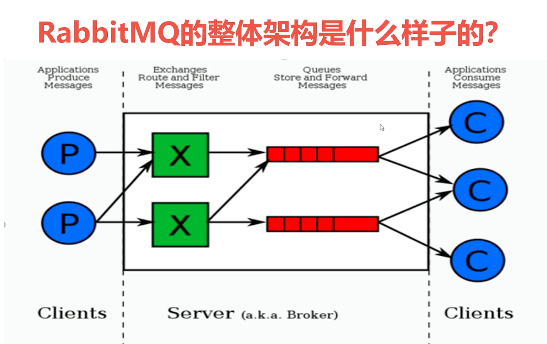
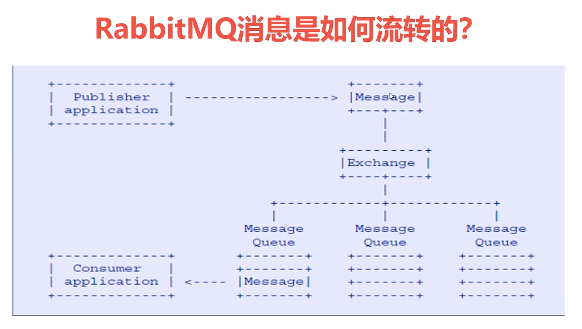

rabbitmq架构

消息流转

安装和使用

[Ubuntu下安装rabbitmq](https://blog.csdn.net/nextyu/article/details/79250174)

基本命令:

rabbitmq-server start &

rabbitmqctl start_app

rabbitmqctl stop_app

rabbitmq-plugins enable rabbitmq_management

rabbitmqctl status 节点状态

