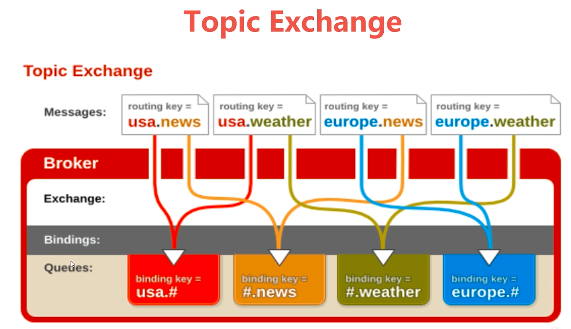

**交换机属性**

name:交换机名称

type:交换机类型:direct topic fanout headers

durability:是否需要持久化，true为持久化

auto delete ：当最后一个绑定到exchange上的队列删除后，自动删除该exchange

**direct exchange**

所有发送到direct exchange的消息被转发到routekey中指定的queue

注意:direct模式可以使用rabbitmq自带的exchange:defalult exchange，所以不需要将exchange进行任何绑定(binding)操作，消息传递时，routekey必须完全匹配才会被队列接收，否则该消息将会被抛弃

**topic exchange**

1. 所有发送到topic exchange的消息被转发到所有关心routekey中指定topic的queue

2. exchange将routekey和某topic进行模糊匹配，此时队列需要绑定到一个topic

模糊匹配

”#“  匹配一个或多个词

"*"  匹配一个词

”.“ 隔离一个词

**fanout exchange**

1. 不处理路由键，只需要简单的将队列绑定到交换机上

2. 发送到交换机的消息都会被转发到与该交换机绑定的所有队列上

3. fanout交换机转发消息是最快的

