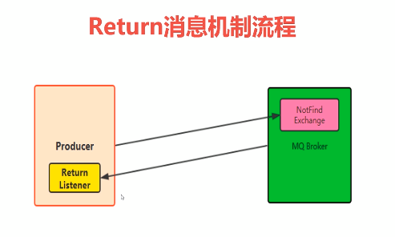

return消息机制

return listener用于处理一些不可路由的消息

我们的消息生产者，通过指定一个exchange 和routingkey，把消息送达到某一个队列中去，然后我们的消费者监听队列，进行消费处理操作

但是在某些情况下，如果我们在发送消息的时候，当前的exchange不存在或者指定的路由key找不到，这个时候如果我们需要监听这种不可达的消息，就要使用return listenen

基础api中关键配置项

mandatory:如果为true，则监听器接收到路由不可达的消息，然后进行后续处理，满broker端会自动删除该消息

 