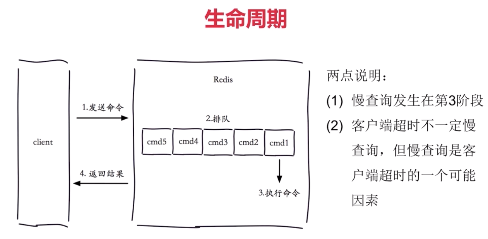
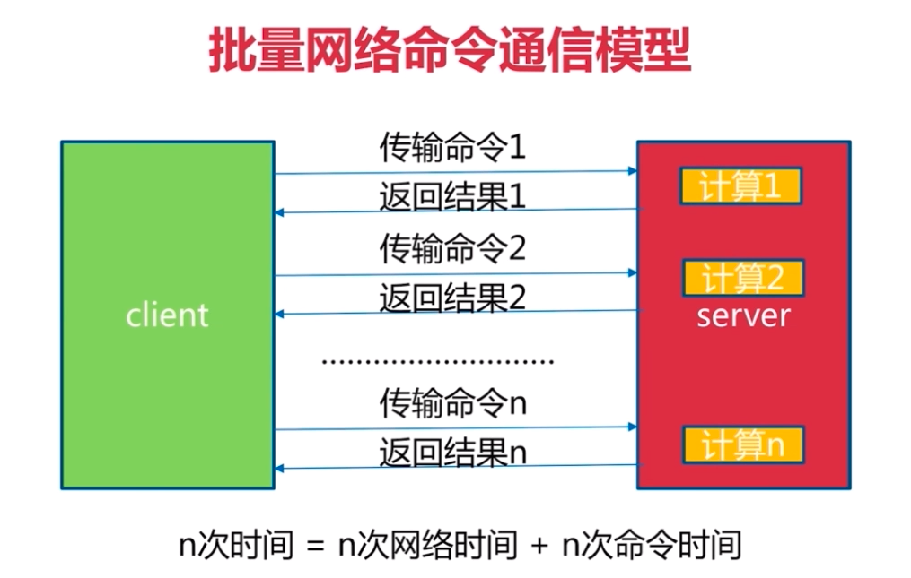
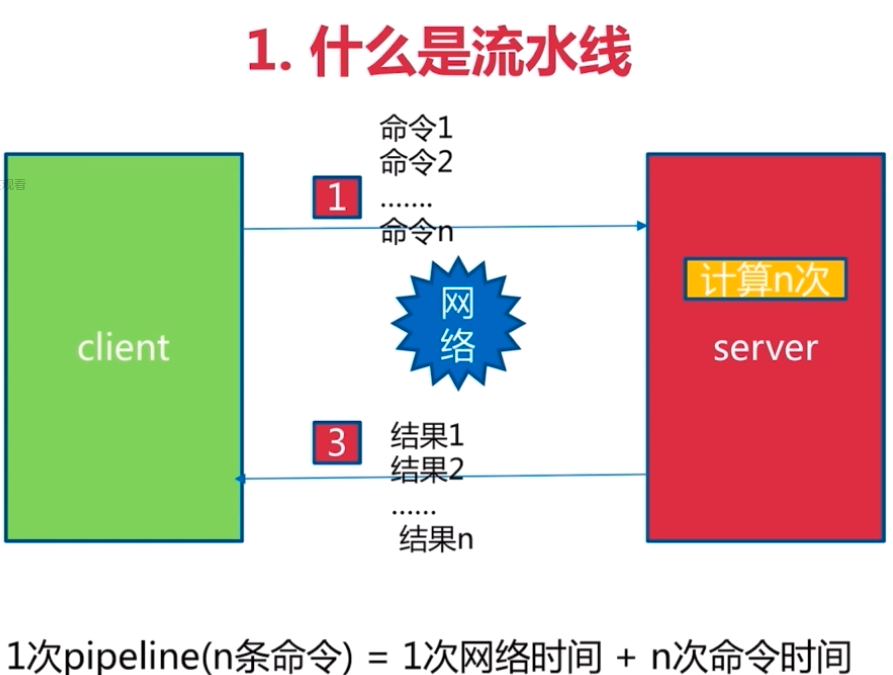

##### 1.慢查询

1. 慢查询生命周期

<div align="center"></div>


2. 两个配置

```bash
config set slowlog-max-len 1000 #设置队列长度
config set slowlog-log-slower-than 1000 #命令执行时间大于该值，则进入等待队列
```

3. 慢查询命令

```bash
slowlog get [n] #获取慢查询队列
slowlog len #获取慢查询队列长度
```

##### 2.pipeline


<div align="center"></div>


<div align="center"></div>