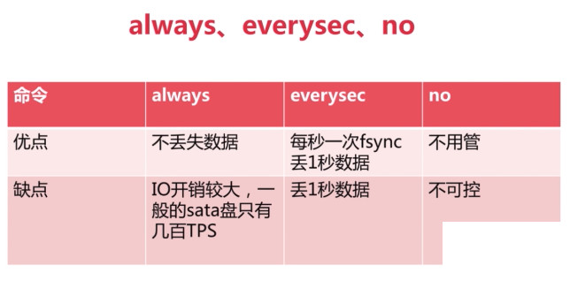
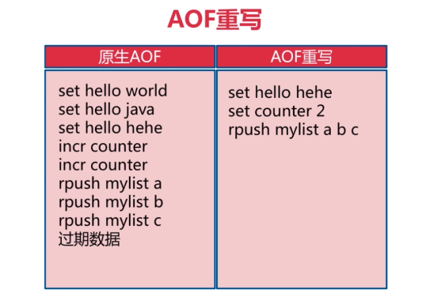
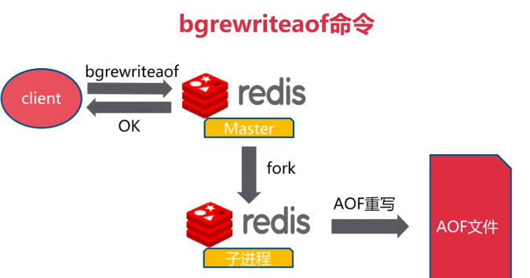
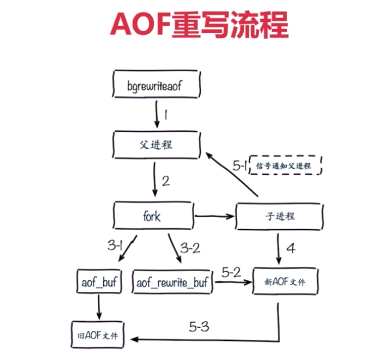
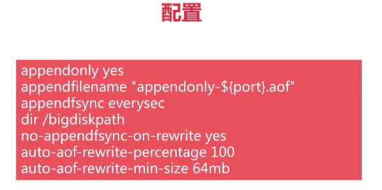
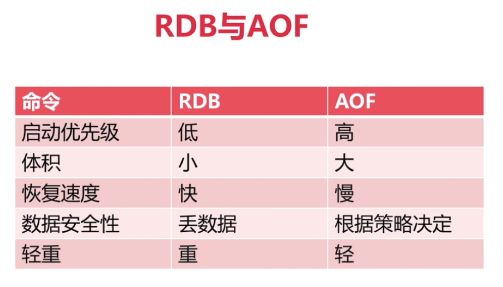

##### aof运行原理

##### aof三种策略

**always**

**everysec**

**no**

##### 比较

##### AOF

aof重写举例

**实际是在内存中进行重写，然后写入aof文件**

减少磁盘占用量

加速恢复速度

aof重写两种实现方式

bgrewriteaof

aof重写配置

aof重写流程

aof相关配置

rdb与aof比较

