数据副本

扩展读性能

1. 一个master一个可以有多个slave
2. 一个slave只能有一个master
3. 数据流向是单向的，master到slave

两种实现方式

1.命令实现

<div align="center">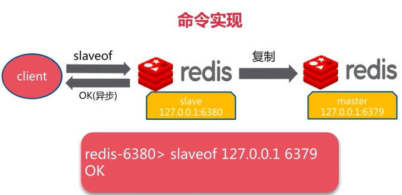</div>

<div align="center">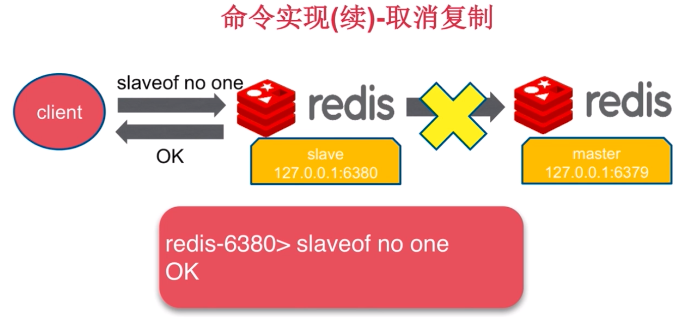</div>

实例:

```bash
~/redis-5.0.5/config$ cp redis-6379.conf redis-6380.conf #产生redis-6380.conf

#修改redis-6380.conf
port 6380
pidfile /var/run/redis_6380.pid
logfile "/home/young/redis-5.0.5/log/log-6380.log"
dbfilename dump-6380.rdb

#启动主机
~/redis-5.0.5/config$ redis-server redis-6379.conf
~/redis-5.0.5/config$ redis-cli -p 6379
127.0.0.1:6379> info replication #该机信息
# Replication
role:master #主
connected_slaves:0 #从机数0
127.0.0.1:6379> exit #客户端退出

#启动另一台机
~/redis-5.0.5/config$ redis-server redis-6380.conf
~/redis-5.0.5/config$ redis-cli -p 6380 #连接
127.0.0.1:6380> info replication
# Replication
role:master #主
connected_slaves:0 #从机数0
127.0.0.1:6380> slaveof 127.0.0.1 6379 #将该机设置为127.0.0.1 6379的从机
OK
127.0.0.1:6380> info replication #该机信息
# Replication
role:slave #从
master_host:127.0.0.1 #主机ip
master_port:6379 #主机port
master_link_status:up #连接状态
127.0.0.1:6380> exit #客户端退出

#重新连上主机
~/redis-5.0.5/config$ redis-cli -p 6379
127.0.0.1:6379> info replication
# Replication
role:master #主
connected_slaves:1 #从机数0
slave0:ip=127.0.0.1,port=6380,state=online,offset=182,lag=1 #从机信息
127.0.0.1:6379> set hello world #主机中写操作
OK
127.0.0.1:6379> get hello
"world"
127.0.0.1:6379> exit #退出主机客户

#检验复制结果
~/redis-5.0.5/config$ redis-cli -p 6380 #连接从机
127.0.0.1:6380> get hello #从机中读取
"world"
127.0.0.1:6380> slaveof no one #解除从属关系，取消复制
OK
127.0.0.1:6380> info replication #查看该机信息
# Replication
role:master
connected_slaves:0
127.0.0.1:6380> get hello #依旧可以获取到之前保存的值
"world"
127.0.0.1:6380> exit #退出6380

~/redis-5.0.5/config$ redis-cli -p 6379 #连接6379
127.0.0.1:6379> info replication #查看信息
# Replication
role:master
connected_slaves:0
127.0.0.1:6379> set haha hehe
OK
127.0.0.1:6379> get haha
"hehe"
127.0.0.1:6379> get hello
"world"
127.0.0.1:6379> exit

~/redis-5.0.5/config$ redis-cli -p 6380
127.0.0.1:6380> get hello
"world"
127.0.0.1:6380> slaveof 127.0.0.1 6379
127.0.0.1:6380> exit

~/redis-5.0.5/config$ redis-cli -p 6379
127.0.0.1:6379> set key value
OK
127.0.0.1:6379> get key
"value"
127.0.0.1:6379> get hello
"world"
127.0.0.1:6379> get haha
"hehe"
127.0.0.1:6379> exit

~/redis-5.0.5/config$ redis-cli -p 6380
127.0.0.1:6380> get hello
"world"
127.0.0.1:6380> get haha
"hehe"
127.0.0.1:6380> get key
"value"

127.0.0.1:6380> slaveof no one
OK
127.0.0.1:6380> set mykey myvalue
OK
127.0.0.1:6380> get mykey
"myvalue"
127.0.0.1:6380> slaveof 127.0.01 6379
OK
127.0.0.1:6380> get mykey
(nil)
```

总结:

1. `slaveof host port`  设置为`host port`的从机
2. `slaveof no one`  解除从机
3. 当一个机器成为一个从机后，它之前在内存中的数据都被删除，取而代之的是主机的数据

##### 全量复制

<div align="center">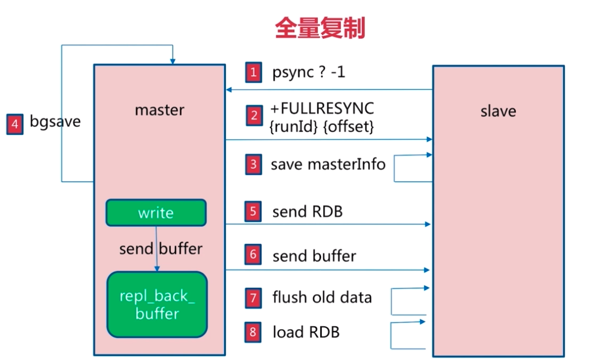</div>

开销:

1. bgsave时间
2. RDB文件网络传输时间
3. 从节点清空数据时间
4. 从节点加载rdb时间
5. 可能的aof重写时间

##### 部分复制

<div align="center">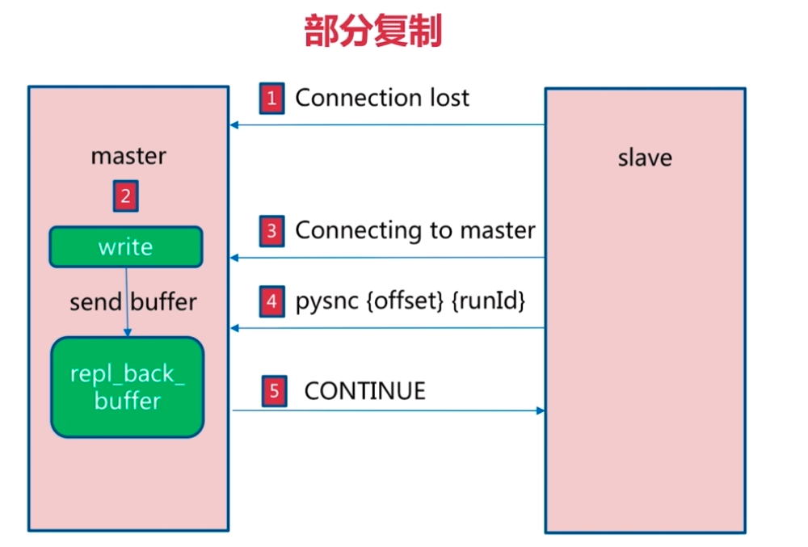</div>

##### 故障处理

slave故障

<div align="center">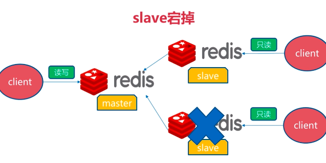</div>

<div align="center">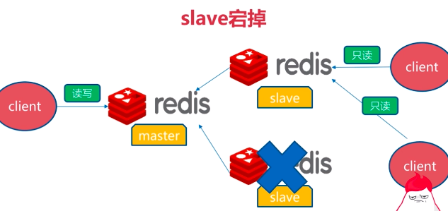</div>

主机故障

<div align="center">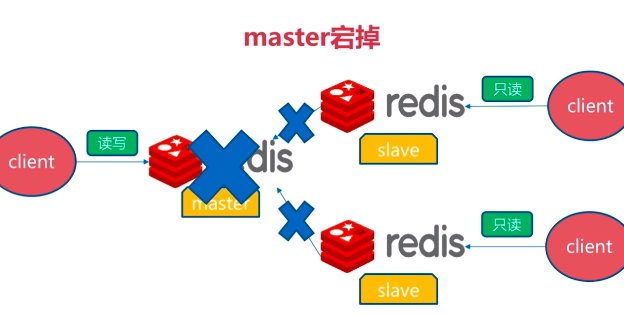</div>

<div align="center">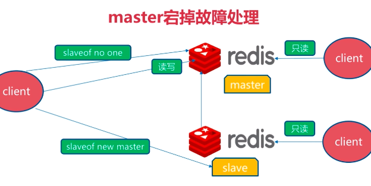</div>

开发与运维中的问题

1.读写分离

<div align="center">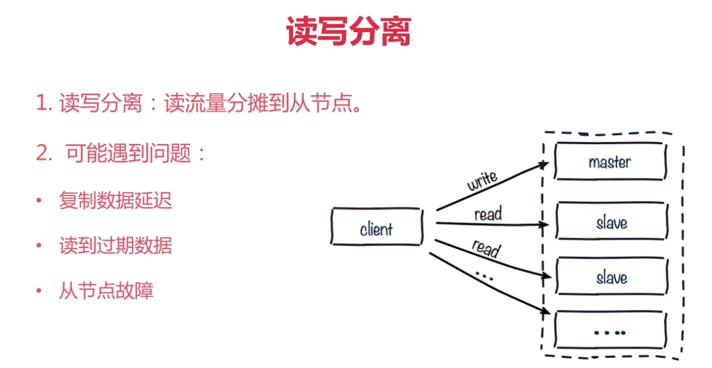</div>

2.配置不一致

<div align="center">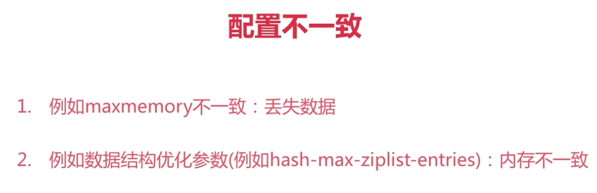</div>

3.规避全量复制

<div align="center">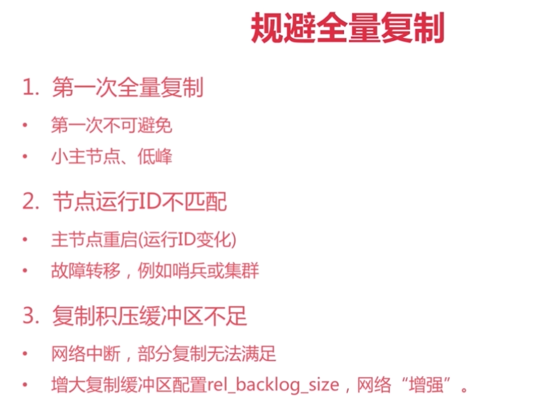</div>

4.规避复制风暴

<div align="center">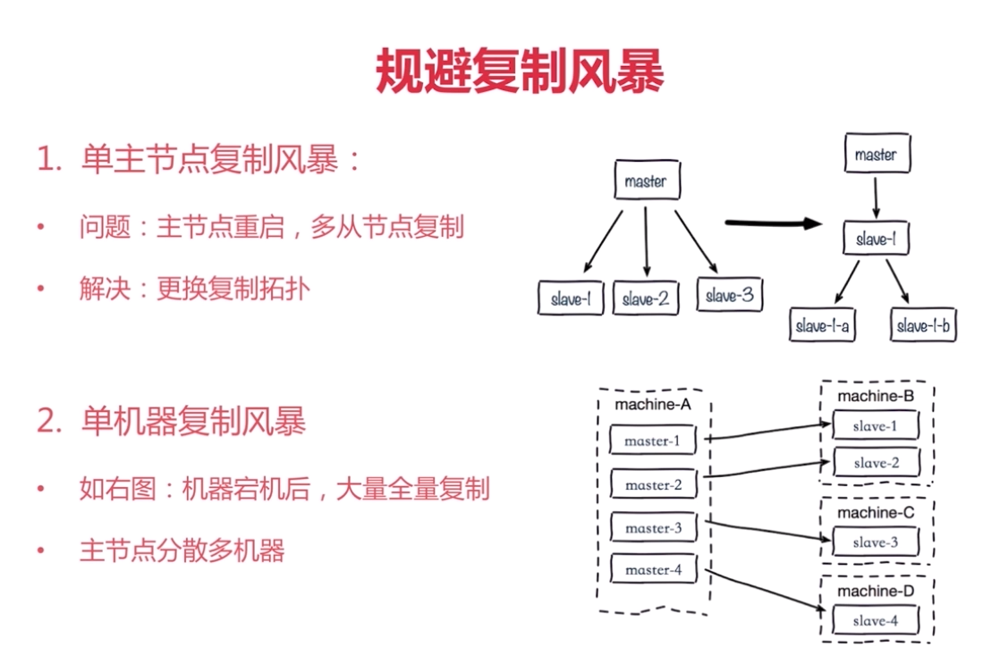</div>

