<div align="center">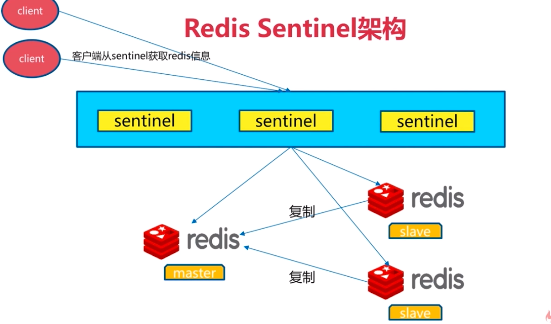</div>

<div align="center">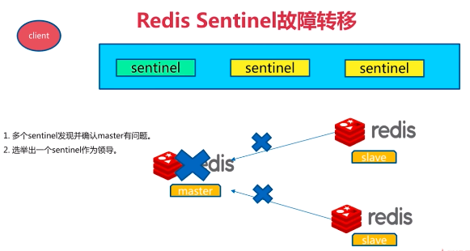</div>

<div align="center">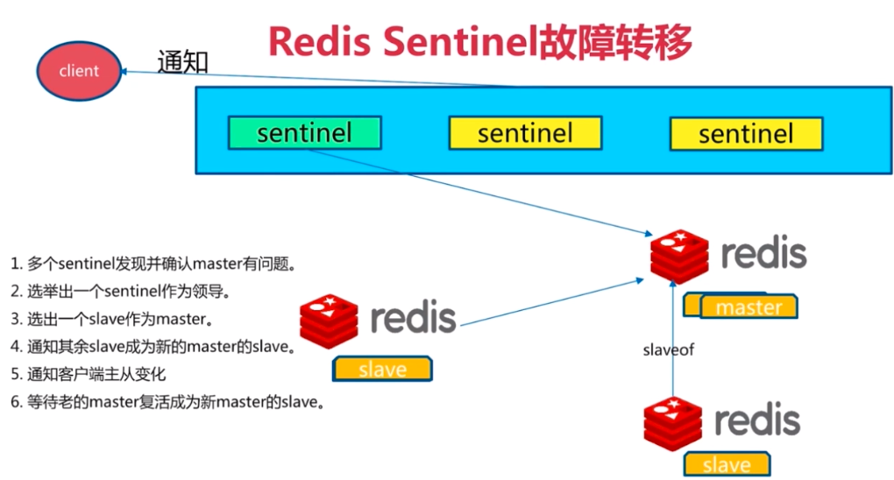</div>

##### 安装与配置

1. 配置开启主从节点
2. 配置开启sentinel监控主节点(sentinel是特殊的redis)

配置实例

<div align="center">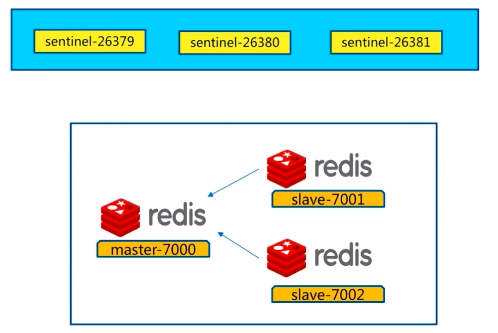</div>

<div align="center">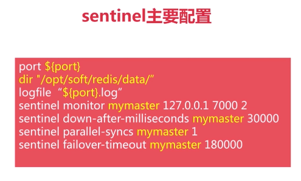</div>

```bash
# redis-7000.conf
port 7000
protected-mode no
daemonize yes
pidfile /var/run/redis_7000.pid
logfile "/home/young/redis-5.0.5/log/log-7000.log"
dir /home/young/redis-5.0.5/data/
# redis-7001.conf
port 7001
protected-mode no
daemonize yes
pidfile /var/run/redis_7001.pid
logfile "/home/young/redis-5.0.5/log/log-7001.log"
dir /home/young/redis-5.0.5/data/
# redis-7002.conf
port 7002
protected-mode no
daemonize yes
pidfile /var/run/redis_7002.pid
logfile "/home/young/redis-5.0.5/log/log-7002.log"
dir /home/young/redis-5.0.5/data/

#启动主7000
~/redis-5.0.5/config$ redis-server redis-7000.conf
#启动从7001
~/redis-5.0.5/config$ redis-server redis-7001.conf
~/redis-5.0.5/config$ redis-cli -p 7001
127.0.0.1:7001> slaveof 127.0.0.1 7000
OK
127.0.0.1:7001> exit
#启动从7002
young@young:~/redis-5.0.5/config$ redis-server redis-7002.conf
young@young:~/redis-5.0.5/config$ redis-cli -p 7002
127.0.0.1:7002> slaveof 127.0.0.1 7000
OK
127.0.0.1:7002> exit

#配置sentinel-26379.conf
port 26379
daemonize yes
pidfile /var/run/redis-sentinel-26379.pid
logfile "/home/young/redis-5.0.5/log/log-26379.log"
dir /home/young/redis-5.0.5/data/
sentinel monitor mymaster 127.0.0.1 7000 2
sentinel down-after-milliseconds mymaster 30000
sentinel parallel-syncs mymaster 1
sentinel failover-timeout mymaster 180000
sentinel deny-scripts-reconfig yes
#配置sentinel-26380.conf
port 26380
daemonize yes
pidfile /var/run/redis-sentinel-26380.pid
logfile "/home/young/redis-5.0.5/log/log-26380.log"
dir /home/young/redis-5.0.5/data/
sentinel monitor mymaster 127.0.0.1 7000 2
sentinel down-after-milliseconds mymaster 30000
sentinel parallel-syncs mymaster 1
sentinel failover-timeout mymaster 180000
sentinel deny-scripts-reconfig yes
#配置sentinel-26381.conf
port 26381
daemonize yes
pidfile /var/run/redis-sentinel-26381.pid
logfile "/home/young/redis-5.0.5/log/log-26381.log"
dir /home/young/redis-5.0.5/data/
sentinel monitor mymaster 127.0.0.1 7000 2
sentinel down-after-milliseconds mymaster 30000
sentinel parallel-syncs mymaster 1
sentinel failover-timeout mymaster 180000
sentinel deny-scripts-reconfig yes
#启动sentinel
~/redis-5.0.5/config$ redis-sentinel sentinel-26379.conf
~/redis-5.0.5/config$ redis-sentinel sentinel-26380.conf
~/redis-5.0.5/config$ redis-sentinel sentinel-26381.conf
#检测sentinel 26379 26381相同
~/redis-5.0.5/config$ redis-cli -p 26380 info sentinel
# Sentinel
sentinel_masters:1
sentinel_tilt:0
sentinel_running_scripts:0
sentinel_scripts_queue_length:0
sentinel_simulate_failure_flags:0
master0:name=mymaster,status=ok,address=127.0.0.1:7000,slaves=2,sentinels=3
```

##### 客户端实现

<div align="center">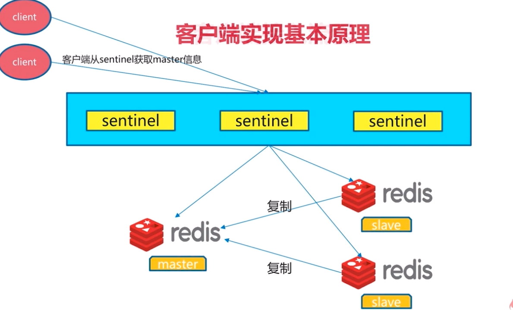</div>

<div align="center">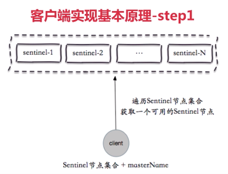</div>

<div align="center">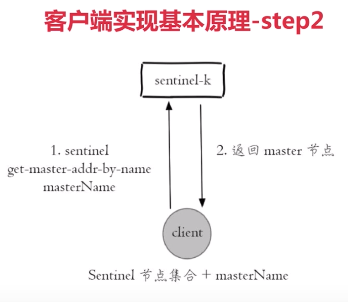</div>

<div align="center">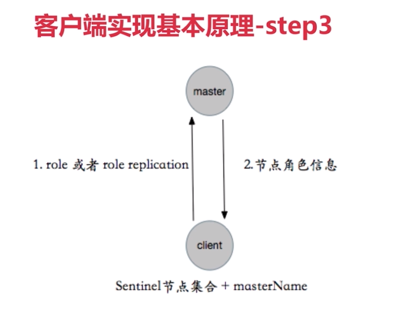</div>

<div align="center">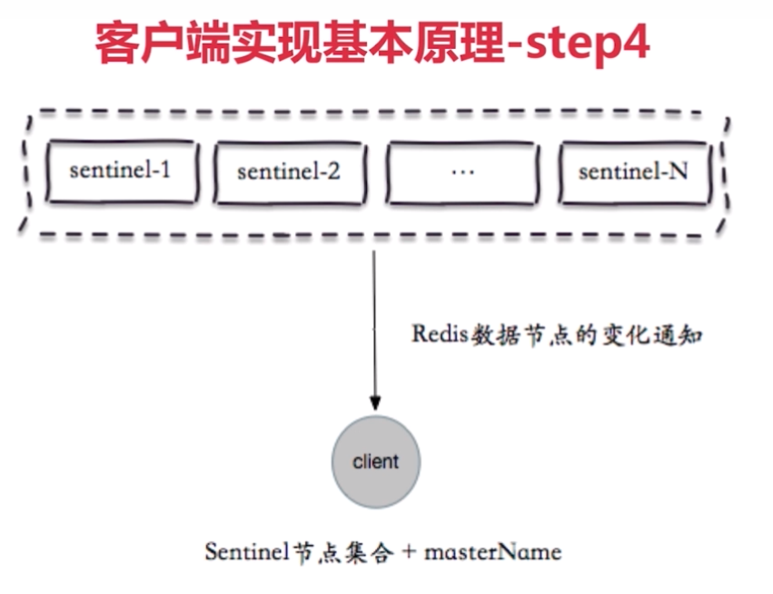</div>

java连接

```java
        String masterName = "mymaster";//master

        //sentinels集合
        Set<String> sentinels = new HashSet<String>();
        sentinels.add("127.0.0.1:26379");
        sentinels.add("127.0.0.1:26380");
        sentinels.add("127.0.0.1:26381");

        JedisSentinelPool jedisSentinelPool = new 
                                   JedisSentinelPool(masterName,sentinels);

        int n = 10;
        while ((n--) != 0){
            Jedis jedis = null;
            try{
                //获取jedis
                jedis = jedisSentinelPool.getResource();
                String key = "key-"+n;
                String value = "value-"+n;
                jedis.set(key,value);
                System.out.println("key-"+n+":"+jedis.get("key-"+n));
            }catch (Exception ex){
                ex.printStackTrace();
            }finally {
                if(jedis != null){
                    jedis.close();
                }
            }
        }        
```


实现

<div align="center">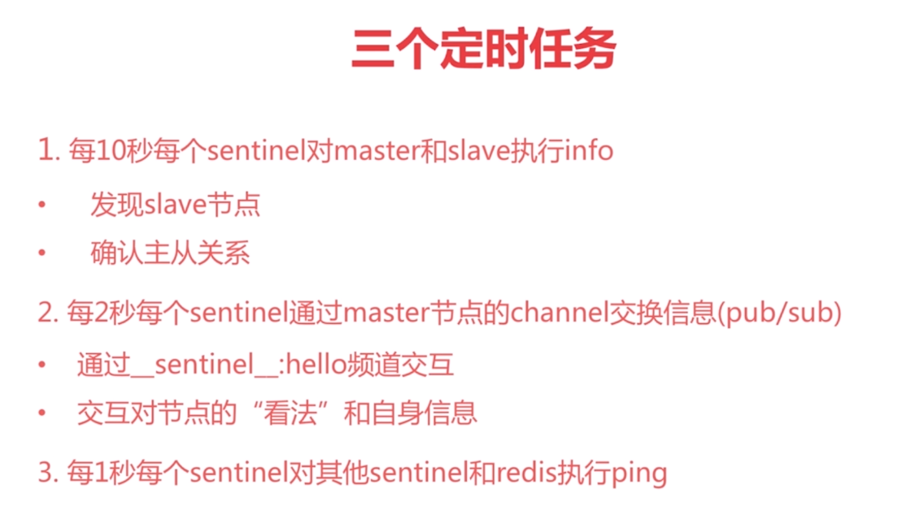</div>

<div align="center">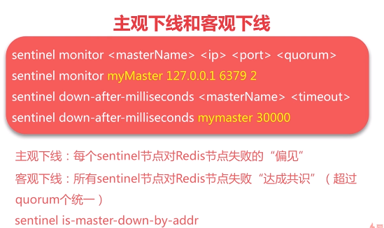</div>

<div align="center">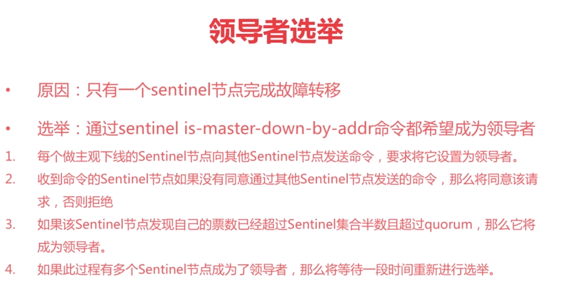</div>

<div align="center">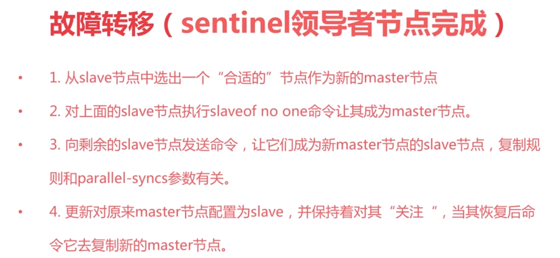</div>

<div align="center">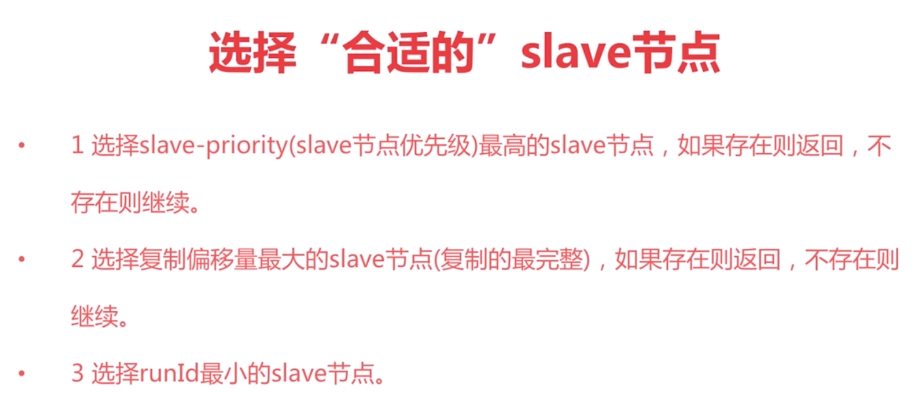</div>