#### 分布式数据库-数据分区

<div align ="center">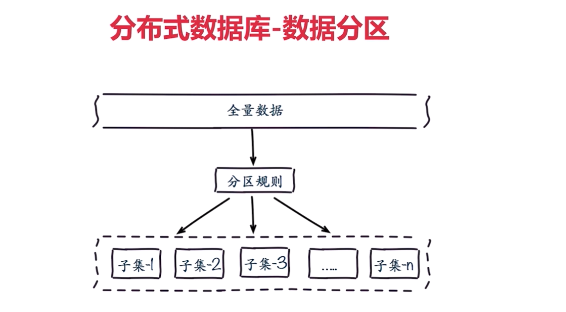</div>

 

顺序分区和哈希分区

<div align ="center">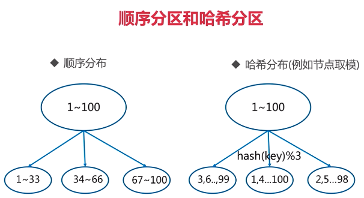</div>

<div align ="center">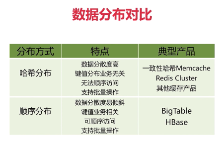</div>

#####  哈希分布

**1.节点取余**

客户端分片:哈希+取余

节点伸缩:数据节点关系变化，导致数据迁移，记忆翻倍扩容

<div align ="center">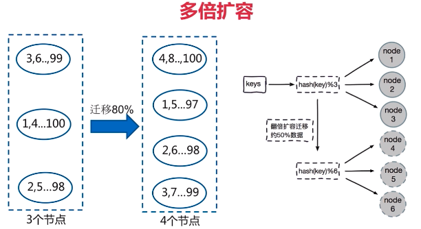</div>

**2.一致性哈希**

客户端分片：哈希+顺时针（优化取余）

节点伸缩：只影响临近节点，但还是有数据迁移

翻倍伸缩:保证最小迁移数据和负载均衡

<div align ="center">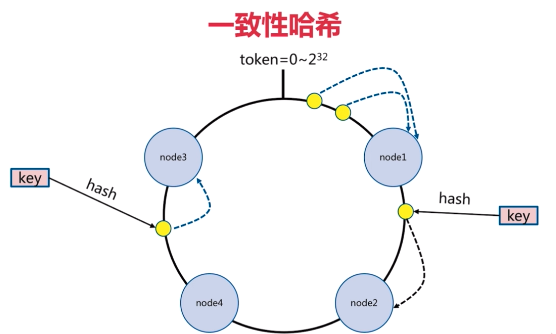</div>

<div align ="center">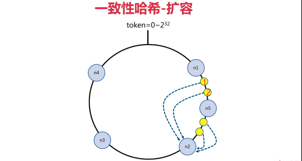</div>

当添加节点n5时，当查找1和2时，会去节点5查找，然而是找不到的，因为此时1和2是在节点n2中存储。

**3.虚拟槽分区**

<div align ="center">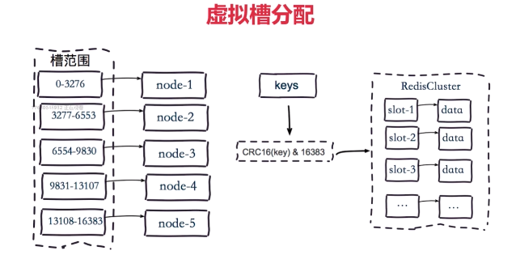</div>

**分布式架构**


<div align ="center">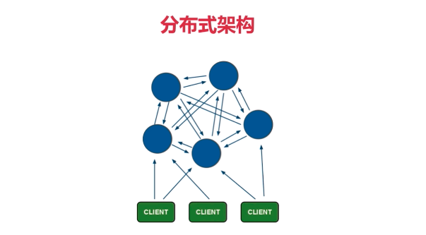</div>

**redis-cluster**


<div align ="center">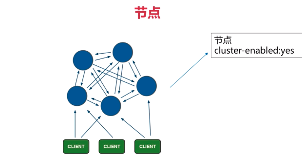</div>

<div align ="center">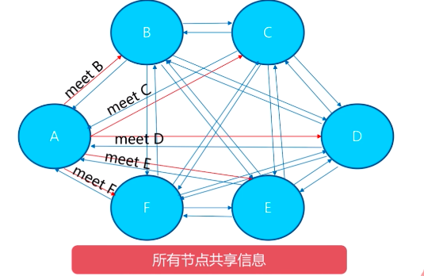</div>


<div align ="center">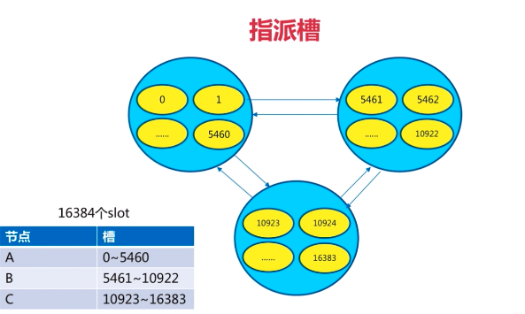</div>

 

##### 原生配置

```bash
###########三主三从#################
#配置开启redis
port ${port}
daemonize yes
dir "opt/redis/data/"
dbfilename "dump-${port}.rdb"
logfile "${port}.log"
cluster-enabled yes
cluster-config-flie nodes-${port}.conf #自动生成，保存该节点信息
cluster-require-full-coverage no
#启动redis 7000-7005相互独立
redis-server redis-7000.conf
redis-server redis-7001.conf
redis-server redis-7002.conf
redis-server redis-7003.conf
redis-server redis-7004.conf
redis-server redis-7005.conf
#meet
#cluster meet ip port 7000-7005可以相互感知
redis-cli -h 127.0.0.1 -p 7000 cluster meet 127.0.0.1 7001
redis-cli -h 127.0.0.1 -p 7000 cluster meet 127.0.0.1 7002
redis-cli -h 127.0.0.1 -p 7000 cluster meet 127.0.0.1 7003
redis-cli -h 127.0.0.1 -p 7000 cluster meet 127.0.0.1 7004
redis-cli -h 127.0.0.1 -p 7000 cluster meet 127.0.0.1 7005
redis-cli -p 7000 cluster info
redis-cli -p 7000 cluster nodes
#分配槽
#cluster addslots slot[slot...] 
redis-cli -h 127.0.0.1 -p 7000 cluster addslots {0...5461}
redis-cli -h 127.0.0.1 -p 7001 cluster addslots {5462...10922}
redis-cli -h 127.0.0.1 -p 7002 cluster addslots {10923...16383}
#设置主从
#cluster replicate node-id
redis-cli -h 127.0.0.1 -p 7003 cluster replicate ${node-id-7000}
redis-cli -h 127.0.0.1 -p 7004 cluster replicate ${node-id-7001}
redis-cli -h 127.0.0.1 -p 7005 cluster replicate ${node-id-7002}
redis-cli -p 7000 cluster slots
redis-cli -c -p 7000
```

